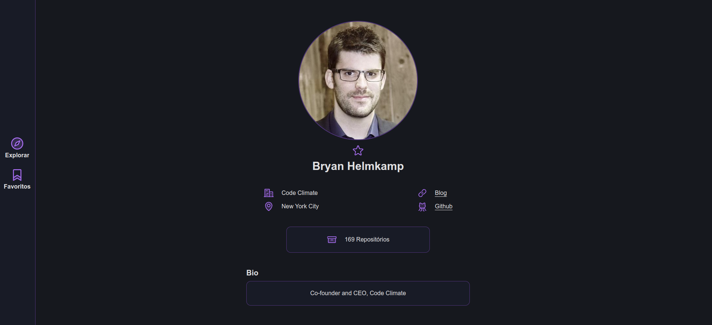
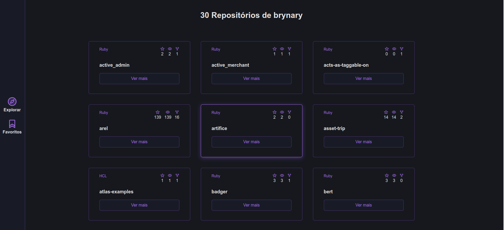
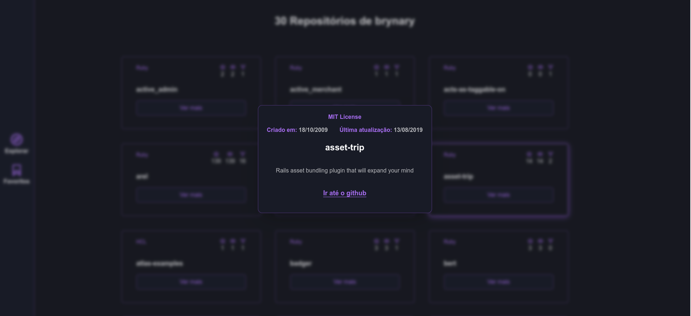

# Github Profile Search

<details>
  <summary><strong>🖥️ Telas da Aplicação</strong></summary><br />

  <h3>Tela de exploração de perfis</h3><br />

  

  <h3>Tela de Perfil</h3><br />

  

  <h3>Tela de Repositórios</h3><br />

  

  <h3>Detalhes de um Repositório</h3><br />

  

</details>
<br />

# Sobre o Projeto
Este  projeto foi feito utilizando a APi do github para explorar e buscar perfis, visualizar informações de perfil, exibir repositórios de um perfil e informações sobre esses repositórios.

## Ferramentas utilizadas

> Linguagens: `HTML/CSS` `Javascript`

> Frameworks: `Tailwind CSS`

> Bibliotecas: `React`, `Phosphor React`

> Plugins: `Daisyui`

> Linters: `Eslint`

### [Link da Aplicação](http://github-profile-search-seven.vercel.app/)

## Para rodar o projeto localmente:

1 - **Clone o repositório**
```bash
git clone git@github.com:imgeff/github-profile-search.git
```

## Executando aplicação

Para rodar a aplicação:

 - Abra um terminal na raiz do projeto
 - Execute o comando `npm run dev`
 - Abra o navegador no endereço -> http://localhost:5173/


